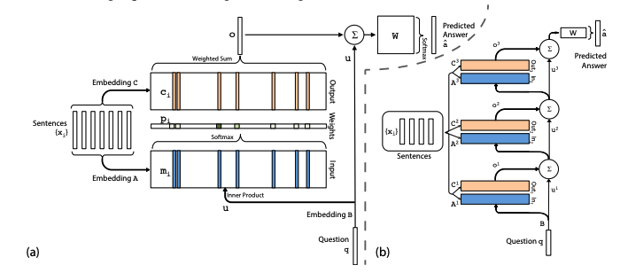

# Info

- 自然言語タスクに対してのモデル
- End-to-end memory network, 2016, https://arxiv.org/pdf/1503.08895.pdf
- Memory Network (2013)の亜種であり、ソフト注意機構を用いている
  - MemNN（Memory Network）は、データを変換してメモリベクトル（特徴量ベクトル）として保持しておいて、
  タスクに応じてそのメモリベクトルの情報を用いるモデル
  - どんなメモリを作成するか、どう用いるか、によって様々な手法が提案された
- https://deeplearning.hatenablog.com/entry/memory_networks

# Approach

ある一文を構成する単語 $x_1,...,x_i$ をメモリに保存して、クエリ $q$ に対して答え $a$ を出力する
タスクを想定する。
ここではクラス分類のようなタスクを想定していて、$\hat{a}$に対して真値$a$との cross-entropyを計算して
勾配降下法によるパラーメータの更新＝学習を行う。

## Attention

ここで説明されている計算手法はattentionであり、特に soft-attentionである。
これはメモリベクトルに softmax を取ることで連続量を出力するものであり、
それに対して何らかの方法で一つの値だけを取り出すことを hard-attentionという。
soft-attentionは特に微分可能、という意味で重要な意味を持っている。

## input memory representation

$V$次元ベクトル$\{x_i\}$ を$d\times V$ 埋め込み行列 $A$ を用いて$d$次元メモリベクトル $\{m_i\}$に変換する。
ここで $x_i$は語彙数分の次元 $V$ を持っており、$m_i$は埋め込み次元$d$次元を持っているとする。
$V$次元クエリ $q$も $d\times V$ 埋め込み行列 $B$ を用いて埋め込んでおり、$d$ 次元の内部状態ベクトル $u$ を得るとする。

内積をとって softmax をとるとすると、

$$
p_i = \text{Softmax} (u^Tm_i) ~ (d\times 1)^T \cdot  d\times 1
$$

これはクエリに対しての共起確率のように捉えることができる。
クエリと各埋め込みベクトル$m_i$の内積を計算して、全体で規格化（softmaxをとる）すると
クエリに対して重要な単語を学習することができる。

## Output memory representationa (=Soft attention)

また同様に $V$次元ベクトル$\{x_i\}$ を$d\times V$ 埋め込み行列 $C$ を用いて $d$ 次元出力ベクトル $\{c_i\}$に変換する。
先程計算した共起確率 $p_i$ との積を計算する（=重み付け、重み平均を計算しているようなもの）。

$$
o = \sum_i p_ic_i
$$

学習の際には、ある特定の重み $p_i$ が大きくなるように（=結果に影響を及ぼすほど $p_ic_i$ の値が大きくなるように）
パラメータを調整していくことになる。

## Generating the final prediction

計算した出力ベクトル $o$ と内部状態ベクトル $u$ を用いて最終的な予測結果を算出する。
$V\times d$ 重み行列 $W$ を用いて

$$
\hat{a} = \text{Softmax}(W(o+u))
$$

## Fig1.

